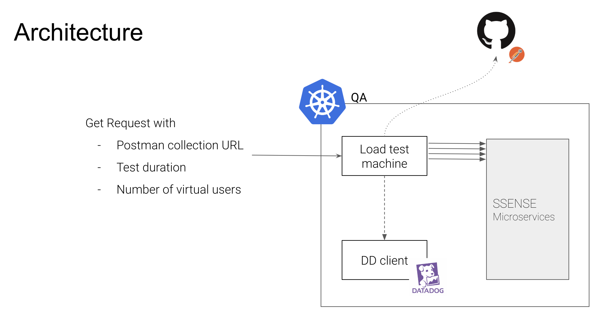

# Load Test Machine

## Prerequesites
- docker

## Local development
- build the docker image
`docker build -t load-test-machine .`
- instanciate the docker image 
`docker run -it -p 9000:9000 load-test-machine:latest sh`
- Once logged in the docker container, start the machine
`webhook-linux-arm64/webhook -hooks k6/hooks.json -verbose`

At this point there is an API open on port 9000 waiting for webhooks to be triggered. The k6 command is reachable using the following REST request
`GET localhost:9000/webhooks/k6?postman_collection_url=<postman collection url>&duration=<k6 test duration>&vus_number=<number of virtual users>`

## Architecture

